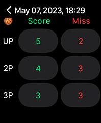
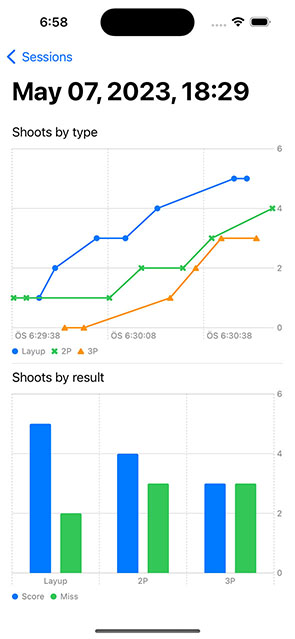

🏀 Hoopscore
===

Hoopscore is a free and open source app for keeping score of your basketball practices with your Apple Watch. The iPhone app also shows the session results with nice [SwiftUI Charts](https://developer.apple.com/documentation/charts). 

⌚️ Watch App (watchOS 8.0+)
----

📱 iPhone App (iOS 16+)
----

🍎 Download (Not released yet!)
----

[App Store](https://apps.apple.com/us/app/hoopscore/id6448628435)